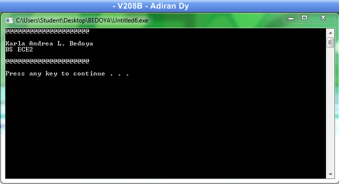
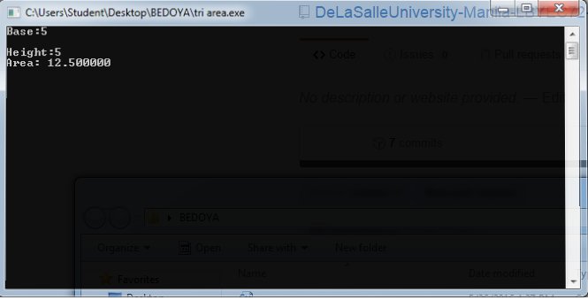
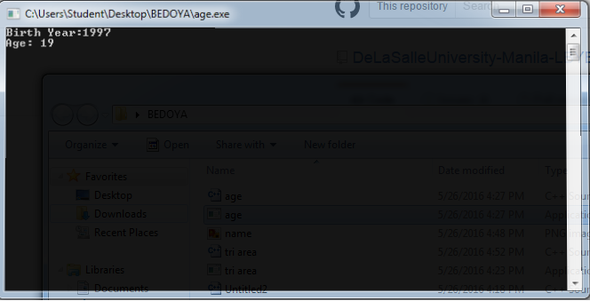
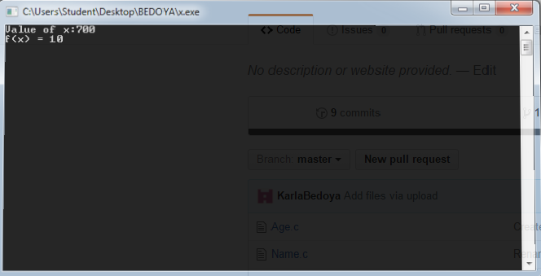

# Activity1-BedoyaK

Activity 1
```
#include <stdio.h>
#include <stdlib.h>

int main()
{printf("@@@@@@@@@@@@@@@@@@@@@\n\n");
 printf("Karla Andrea L. Bedoya\nBS ECE2\n\n");
 printf("@@@@@@@@@@@@@@@@@@@@@\n\n");
 
 system ("PAUSE");
 
}
```


Activity 1.1
```
#include <stdio.h>
#include <stdlib.h>

int main()
{int base, height;
 float area;
 printf("Base:");
 scanf("%d", &base);
 printf("\nHeight:");
 scanf("%d", &height);
 area = 0.5*base*height;
 printf("\nArea: %f", area);
 
 return 0;
}
```


Activity 1.2
```
#include <stdio.h>
#include <stdlib.h>

int main()
{int year, age;
 
 printf("Birth Year:");
 scanf("%d", &year);
 age = 2016-year;
 printf("Age: %d", age);
 
 system("PAUSE");
}
```


Activity 1.3
```
#include <stdio.h>
#include <stdlib.h>

int main()
{int x, fx;

 printf("Value of x:");
 scanf("%d", &x);
 fx=x/70;
 printf("f(x) = %d", fx);
 
 system("PAUSE");
}
```

